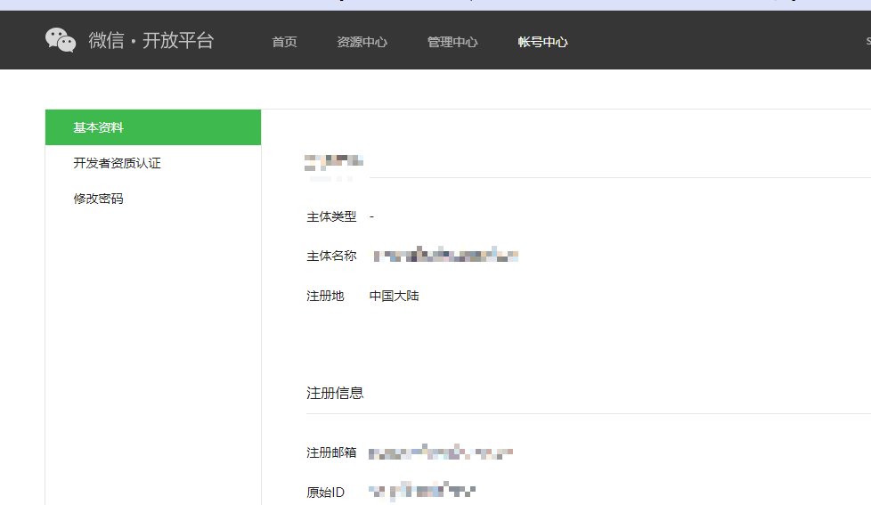
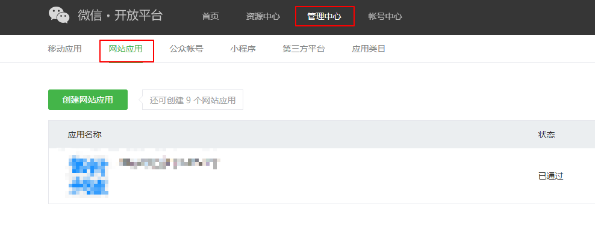
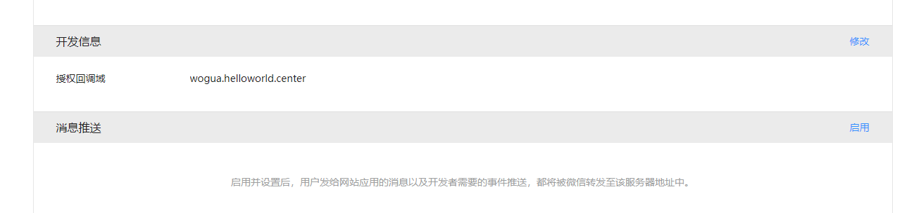

# 前端
# 后端
# 功能模块

## [模块一] 游戏

**地址：** http://wogua.helloworld.center/game

- 2048 完成
- 魔方 未完成

## [模块二] 博客

### 前台

http://wogua.helloworld.center/

## 博客

### 后台

http://wogua.helloworld.center/admin

## [模块三] 物联网

### 基于C51/STM32

**功能简介：**基于C51/STM32、ESP8266和JAVA后台，实现一下功能：

1. C51/STM32每隔一分钟向云端上报温度状况
2. 云端可以通过下发指令控制LED灯亮灭和亮度

### 实现步骤

#### 创建MQTT服务端


MQTT服务端这里采用的是EMQX，具体流程请见：

http://www.helloworld.center/docs/basic/01.protocol/02.EMQX.html

#### ESP8266链接物联网平台

> stat模式连接网络

```shell
AT+CIPMUX=0     // 设置单链接
AT+CWMODE_CUR=1 // 设置仅stat模式
AT+CWJAP="prinfo-708","prinfo666" // 链接网络
AT+CIFSR // 查看IP信息
```

> 登录报文编写

```shell
10						// 固定头				
20                      // 代表数据长度
00 06					// 数据协议字节长度
4D 51 49 73 64 70 		// MQIsdp
03					    // 版本号 3 
C2						// 连接标志
01 2C					// 活动时间300s
00 04					// 客户端长度 4
74 65 73 74				// 客户端ID用户名对应16进制
00 05                   // 服务器用户名长度5
77 6F 67 75 61	    	// 用户名对应16进制
00 05                   // 服务器密码长度5
77 6F 67 75 61			// 服务器密码对应16进制

res: 10 20 00 06 4D 51 49 73 64 70 03 C2 01 2C 00 04 74 65 73 74 00 05 77 6F 67 75 61 00 05 77 6F 67 75 61
```

> 登录MQTT服务器

```shell
AT+CIPSTART="TCP","127.0.0.1",1883 // 连接EMQX TCP端口
需要注意的是链接TCP后需要在几秒内登录，不然会被踢出
AT+CIPMODE=1 //开启穿透
AT+CIPSEND // 穿透发送
发送16进制数据登录
10 20 00 06 4D 51 49 73 64 70 03 C2 01 2C 00 04 74 65 73 74 00 05 77 6F 67 75 61 00 05 77 6F 67 75 61
```

> 定时发送心跳包

定时向MQTT Broker发送心跳包

```c
C0 00
```

>订阅主题

```c
82 // 固定头
09 // 数据包长度不包含自己
00 01 //消息识别
00 04 //主题长度
74 65 73 74 //主题名
00 //Qos
```

> 发布消息

```c
30  // 固定头
80  // 数据包长度不包含自己
00 04 // topic 长度
04 74 65 6D // topic 数据
01 6E   //消息 数据
```

## [模块四] 微信登录

采用的是JustAuth

https://justauth.wiki/

### 申请应用

#### 注册微信开放平台账号

https://open.weixin.qq.com/

#### 申请开发者资质认证

 微信开放平台创建应用，需要申请**开发者资质认证**

账号中心->开发者资质认证



**注意：**不支持个人开发者，需要企业认证

- 用自己公司的信息做认证（请确保合法合规）
- 找朋友帮忙认证
- 去TB或者其他平台花钱找人认证，这种方式一般支持：短期租、长期认证

#### 创建第三方应用



#### 三要素

1. Client ID
2. Client Secret
3. Callback URL 

需要注意的是回调的域名可以随便填，但是要和回调重定向的域名一样，不然会有参数异常错误

如果有不是80端口也需要加上端口



### 集成JustAuth

#### 依赖

```xml
<dependency>
    <groupId>me.zhyd.oauth</groupId>
    <artifactId>JustAuth</artifactId>
    <version>${latest.version}</version>
</dependency>
```

版本：https://github.com/justauth/JustAuth/releases

#### 创建Request

```java
AuthRequest authRequest = new AuthWeChatRequest(AuthConfig.builder()
                .clientId("Client ID")
                .clientSecret("Client Secret")
                .redirectUri("https://www.zhyd.me/oauth/callback/wechat")
                .build());
```

**注意：**redirectUri的域名就需要和上面填写的回调域一样(域名一样)

#### 生成授权地址

生成授权链接，供手机扫码

```java
String authorizeUrl = authRequest.authorize(AuthStateUtils.createState());
```

这个链接我们可以直接后台重定向跳转，也可以返回到前端后，前端控制跳转。前端控制的好处就是，可以将第三方的授权页嵌入到iframe中，适配网站设计。

#### 以上完整代码如下

由于是SpringBoot项目所以我将参数都封装成对象

```java
@Data
@Component
@ConfigurationProperties(prefix = "wx.login")
public class WxLoginProperty {

    /**
     * ID
     */
    private String clientId;

    /**
     * 秘钥
     */
    private String clientSecret;

    /**
     * 回调地址
     */
    private String callbackUrl;

    /**
     * 登录成功后回调
     */
    private String successRedirectUrl;
}
```

完整流程

```java
@RestController
@RequestMapping("wx/auth")
public class WxAuth {

    @Autowired
    private WxLoginProperty wxLoginProperty;

    @Autowired
    private SysUserService userService;

    /**
     * 重定向到二维码
     * @param response
     * @throws IOException
     */
    @RequestMapping("/render")
    public void renderAuth(HttpServletResponse response) throws IOException {
        AuthRequest authRequest = getAuthRequest();
        response.sendRedirect(authRequest.authorize(AuthStateUtils.createState()));
    }

    @RequestMapping("/callback")
    public void login(AuthCallback callback, HttpServletResponse response) throws IOException {
        AuthRequest authRequest = getAuthRequest();
        AuthResponse authResponse = authRequest.login(callback);
        AuthUser authUser = (AuthUser) authResponse.getData();
        // 获取open id
        JSONObject rawUserInfo = authUser.getRawUserInfo();
        String openid = rawUserInfo.getString("openid");
        // 根据open id 查询
        SysUser sysUser = userService.findByWxOpenId(openid);
        String successRedirectUrl = wxLoginProperty.getSuccessRedirectUrl();
        successRedirectUrl = successRedirectUrl + "?bind=";
        if(sysUser != null) {// 绑定过
            sysUser.setPassword(null);
            StpUtil.login(sysUser.getId(),"PC");
            StpUtil.getSession().set("user", sysUser);
            TokenInfoDTO tokenInfoDTO = new TokenInfoDTO(StpUtil.getTokenName(), StpUtil.getTokenValue());
            successRedirectUrl = successRedirectUrl + "true&tokenName=" + tokenInfoDTO.getTokenName() + "&tokenValue=" + tokenInfoDTO.getTokenValue();
        }else { // 未绑定过
            successRedirectUrl = successRedirectUrl + "false&openId=" + openid;
        }
        response.sendRedirect(successRedirectUrl);
    }

    private  AuthRequest getAuthRequest() {
        return new AuthWeChatOpenRequest(AuthConfig.builder()
                .clientId(wxLoginProperty.getClientId())
                .clientSecret(wxLoginProperty.getClientSecret())
                .redirectUri(wxLoginProperty.getCallbackUrl())
                .build());
    }


    /**
     * 绑定登录
     * @param loginVo
     * @return
     */
    @PostMapping("bind/{openId}")
    public Result login(@RequestBody LoginVO loginVo, @PathVariable("openId") String openId) {
        SysUser sysUser = userService.findByMailOrMobile(loginVo.getUsername());
        if(sysUser == null || !BCrypt.checkpw(loginVo.getPassword(),sysUser.getPassword())) throw new ApiException(ResCode.ERROR_USERNAME_OR_PWD);
        StpUtil.login(sysUser.getId(),"PC");
        StpUtil.getSession().set("user", sysUser);
        TokenInfoDTO tokenInfoDTO = new TokenInfoDTO(StpUtil.getTokenName(), StpUtil.getTokenValue());
        // 更新 wx open id
        sysUser.setWxOpenId(openId);
        userService.updateById(sysUser);
        return Result.ok(tokenInfoDTO);
    }
}

```

#### 授权结果

```java
{
	"code": 2000,
	"msg": null,
	"data": {
		"uuid": "xxxxxxx",
		"username": "RD",
		"nickname": "RD",
		"avatar": "http://thirdwx.qlogo.cn/mmopen/vi_32/DYAIOgq83ereNicKErbtBVnraCnzjGia2ZWPSkI9Ok4ScrmkdiacgPN6D5qeYBf3iba2lXknE7YaMMHHRrMW6Op8eQ/132",
		"blog": null,
		"company": null,
		"location": "中国-北京-",
		"email": null,
		"remark": null,
		"gender": "MALE",
		"source": "WECHAT_OPEN",
		"token": {
			"accessToken": "28_Bzvt4UxxxxFElOxxxxgTqIJmSE5LxB2Az7stFqYVnFoIhL7RbevA0Urc",
			"expireIn": 7200,
			"refreshToken": "28_vtarjUxxxxfKh0Axxxxe_vy7E62hAYkMJ5M_JT4gMXM7r1kT_SeKAQz8Ojow",
			"uid": null,
			"openId": "xxxxxxx",
			"accessCode": null,
			"unionId": "xxxxxxx",
			"scope": null,
			"tokenType": null,
			"idToken": null,
			"macAlgorithm": null,
			"macKey": null,
			"code": null,
			"oauthToken": null,
			"oauthTokenSecret": null,
			"userId": null,
			"screenName": null,
			"oauthCallbackConfirmed": null
		}
	}
}
```

