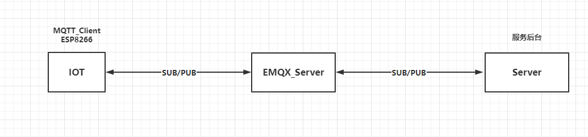

# 前端
# 后端
# 功能模块

## [模块一] 游戏

**地址：** http://wogua.helloworld.center/game

- 2048 完成
- 魔方 未完成

## [模块二] 博客

### 前台

http://wogua.helloworld.center/

## 博客

### 后台

http://wogua.helloworld.center/admin

## [模块三] 物联网

### 基于C51

**功能简介：**基于51、ESP8266和JAVA后台，实现一下功能：

1. C51每隔一分钟向云端上报温度状况
2. 云端可以通过下发指令控制LED灯亮灭和亮度

### 实现步骤

#### 创建MQTT服务端



MQTT服务端这里采用的是EMQX，具体流程请见：

http://www.helloworld.center/docs/basic/01.protocol/02.EMQX.html

#### ESP8266链接物联网平台

> stat模式连接网络

```shell
AT+CIPMUX=0     // 设置单链接
AT+CWMODE_CUR=1 // 设置仅stat模式
AT+CWJAP="prinfo-708","prinfo666" // 链接网络
AT+CIFSR // 查看IP信息
```

> 登录报文编写

```shell
10						// 固定头				
20                      // 代表数据长度
00 06					// 数据协议字节长度
4D 51 49 73 64 70 		// MQIsdp
03					    // 版本号 3 
C2						// 连接标志
01 2C					// 活动时间300s
00 04					// 客户端长度 4
74 65 73 74				// 客户端ID用户名对应16进制
00 05                   // 服务器用户名长度5
77 6F 67 75 61	    	// 用户名对应16进制
00 05                   // 服务器密码长度5
77 6F 67 75 61			// 服务器密码对应16进制

res: 10 20 00 06 4D 51 49 73 64 70 03 C2 01 2C 00 04 74 65 73 74 00 05 77 6F 67 75 61 00 05 77 6F 67 75 61
```

> 登录MQTT服务器

```shell
AT+CIPSTART="TCP","127.0.0.1",1883 // 连接EMQX TCP端口
需要注意的是链接TCP后需要在几秒内登录，不然会被踢出
AT+CIPMODE=1 //开启穿透
AT+CIPSEND // 穿透发送
发送16进制数据登录
10 20 00 06 4D 51 49 73 64 70 03 C2 01 2C 00 04 74 65 73 74 00 05 77 6F 67 75 61 00 05 77 6F 67 75 61
```

> 定时发送心跳包

